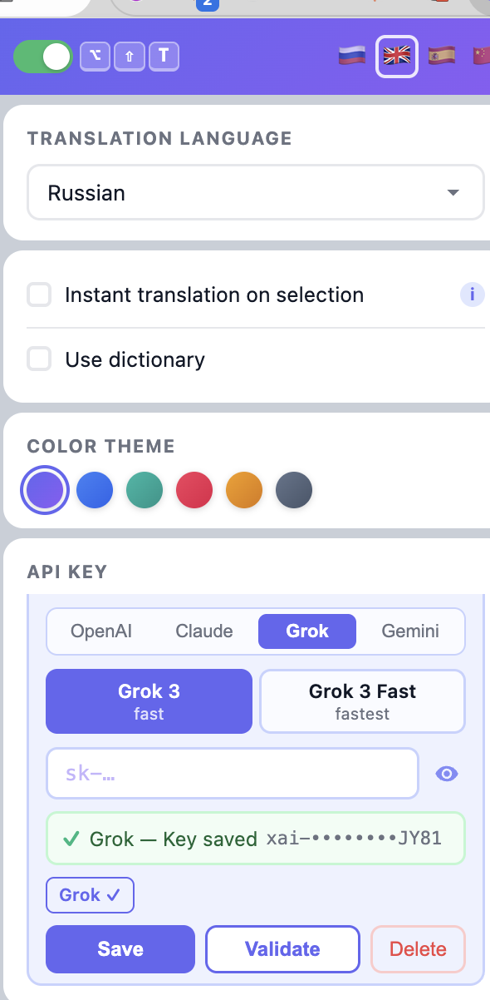
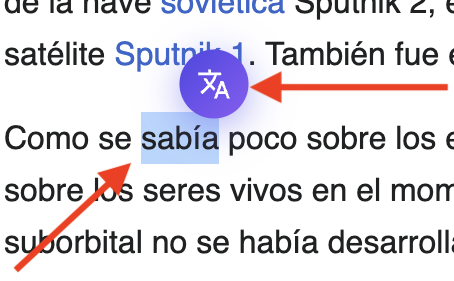
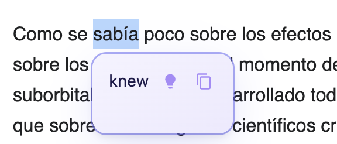
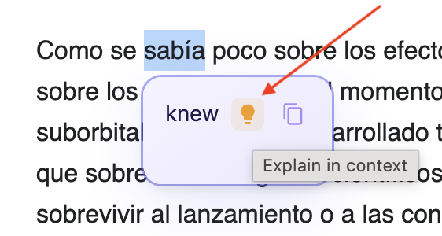
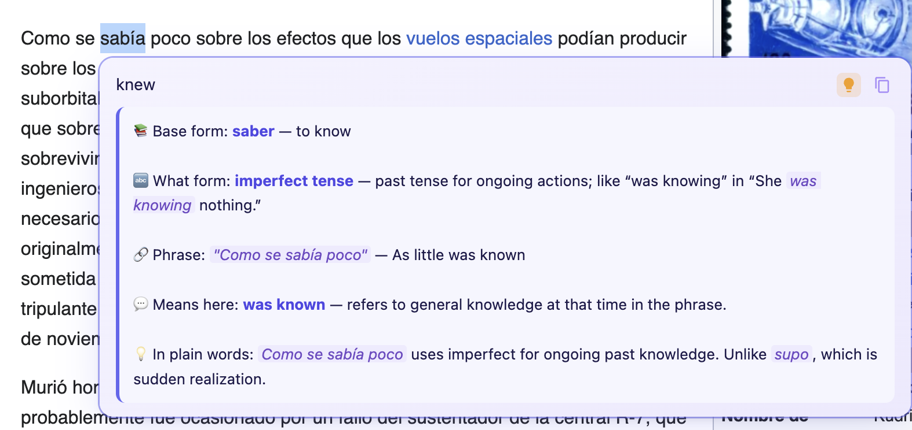
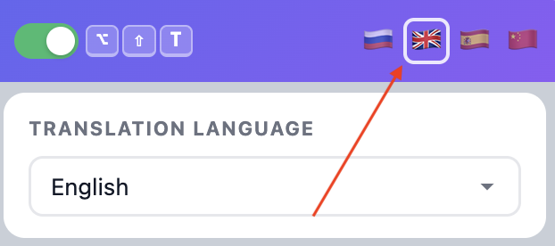

> **Language / Язык:**&ensp; [](#english) &ensp; [](#русский)

---

<a id="english"></a>

# Selection TranslateAI — Chrome Extension

**Translate any selected text on any webpage using AI — and understand *why* a word is used in that exact form.**
Pick your provider, bring your own API key, and get instant translations + in-context grammar explanations powered by OpenAI, Claude, Grok, or Gemini.

<p align="center">
  
</p>

## Features

- **Select & Translate** — highlight text on any page and get an AI-powered translation in a popup
- **Contextual explanation** — a lamp 💡 button reveals **base form**, **grammatical form with an example**, the **phrase** the word belongs to, meaning in context, and a plain-language reason why this form is used — perfect for learning conjugated / inflected languages
- **Streaming** — translation appears word-by-word in real time
- **4 AI Providers** — OpenAI (GPT-4o), Anthropic (Claude), xAI (Grok), Google (Gemini)
- **Model selection** — choose between fast and powerful models per provider
- **Per-provider API keys** — save a separate key for each provider, switch freely
- **Instant mode** — translate immediately on text selection (no button click needed)
- **Dictionary** — save words with the `+` button, export as CSV or Excel
- **Dictionary panel** — resizable side panel, opened via button or `Alt+Shift+S`
- **4 interface languages** — Russian, English, Spanish, Chinese
- **17 translation languages** — Arabic, Chinese, Czech, Dutch, English, French, German, Italian, Japanese, Korean, Polish, Portuguese, Russian, Spanish, Swedish, Turkish, Ukrainian
- **6 color themes** — Indigo, Blue, Teal, Rose, Amber, Slate
- **Hotkeys** — `Alt+Shift+T` toggle extension, `Alt+Shift+S` toggle dictionary, `Esc` close popup
- **Privacy** — no data collection, no third-party servers; API calls go directly to the provider you choose

## How it works

**1. Select any word** — a translate button appears right next to your selection.
<p align="center"></p>

**2. Get the translation** — click the button (or use instant mode) to see the translated word with action buttons: 💡 explain, ➕ save to dictionary, ⧉ copy.
<p align="center"></p>

**3. Click the lamp 💡** to request an in-context grammar explanation.
<p align="center"></p>

**4. Read the structured breakdown** — base form, what form it is (with a pattern example), the collocation it appears in, the meaning here, and a clear reason behind the form choice.
<p align="center"></p>

> 💡 The explanation is always written in your **interface language**. Switch it any time by clicking the corresponding flag in the top-right of the extension popup — this also updates all labels, tooltips and the explanation output.
<p align="center"></p>

## Installation

1. Download or clone this repository
2. Open `chrome://extensions/` in Chrome
3. Enable **Developer mode** (top right)
4. Click **Load unpacked** and select the project folder
5. Click the extension icon, choose a provider, enter your API key, and start translating

## Usage

1. **Select text** on any webpage
2. Click the translate button (or enable instant mode for automatic translation)
3. In the popup:
   - **⧉ Copy** — copy both original and translation
   - **➕ Add to dictionary** — save the word (if dictionary is enabled)
   - **💡 Explain in context** — get a structured grammar explanation tied to the exact sentence the word appears in
4. Open the dictionary panel to review saved words, export to CSV/Excel

## Hotkeys

| Shortcut | Action |
|---|---|
| `Alt+Shift+T` | Enable / disable extension |
| `Alt+Shift+S` | Open / close dictionary |
| `Esc` | Close translation popup |

## Supported Models

| Provider | Models |
|---|---|
| OpenAI | GPT-4o mini (fast), GPT-4o (powerful) |
| Anthropic | Haiku (fast), Sonnet (powerful) |
| xAI | Grok 3 (fast), Grok 4 (powerful) |
| Google | Gemini 2.0 Flash (fast), Gemini 2.5 Flash (powerful) |

## Project Structure

```
├── manifest.json     # Extension manifest (MV3)
├── background.js     # Service worker — API calls, caching, streaming, explain handler
├── content.js        # Content script — selection detection, popup, dictionary, sentence capture
├── content.css       # Styles for on-page UI (popup, dictionary, button, explanation)
├── popup.html        # Extension popup markup
├── popup.js          # Popup logic — settings, i18n, key management
├── popup.css         # Popup styles
└── icons/            # Extension icons + workflow screenshots
```

## Privacy & Security

- **No data collection** — the extension does not send data anywhere except the AI provider you select
- **API keys stored locally** — saved in `chrome.storage.local`, never transmitted to third parties
- **No analytics, no tracking, no telemetry**
- **Open source** — review every line of code

## License

MIT

---

<a id="русский"></a>

# Selection TranslateAI — Расширение для Chrome

> [](#english) &ensp; [](#русский)

**Переводите любой выделенный текст на любой веб-странице с помощью ИИ — и понимайте, *почему* слово стоит именно в такой форме.**
Выберите провайдера, введите свой API-ключ и получайте мгновенные переводы + объяснения грамматики в контексте от OpenAI, Claude, Grok или Gemini.

<p align="center">
  
</p>

## Возможности

- **Выдели и переведи** — выделите текст на странице и получите ИИ-перевод во всплывающем окне
- **Объяснение в контексте** — кнопка-лампочка 💡 раскрывает **начальную форму**, **грамматическую форму с примером**, **словосочетание**, в котором стоит слово, его значение здесь и объяснение «на пальцах», почему именно эта форма — находка для изучения языков со склонениями и спряжениями
- **Стриминг** — перевод появляется пословно в реальном времени
- **4 ИИ-провайдера** — OpenAI (GPT-4o), Anthropic (Claude), xAI (Grok), Google (Gemini)
- **Выбор модели** — для каждого провайдера можно выбрать быструю или мощную модель
- **Отдельный ключ для каждого провайдера** — сохраняйте ключи независимо, переключайтесь свободно
- **Мгновенный режим** — перевод запускается сразу при выделении текста (без нажатия кнопки)
- **Словарь** — сохраняйте слова кнопкой `+`, экспортируйте в CSV или Excel
- **Панель словаря** — боковая панель с изменяемым размером, открывается кнопкой или `Alt+Shift+S`
- **4 языка интерфейса** — русский, английский, испанский, китайский
- **17 языков перевода** — арабский, китайский, чешский, нидерландский, английский, французский, немецкий, итальянский, японский, корейский, польский, португальский, русский, испанский, шведский, турецкий, украинский
- **6 цветовых тем** — Indigo, Blue, Teal, Rose, Amber, Slate
- **Горячие клавиши** — `Alt+Shift+T` вкл/выкл расширение, `Alt+Shift+S` словарь, `Esc` закрыть окно
- **Приватность** — никакого сбора данных, никаких сторонних серверов; запросы идут напрямую к выбранному провайдеру

## Как это работает

**1. Выделите слово** — рядом появляется кнопка перевода.
<p align="center"></p>

**2. Получите перевод** — кликните кнопку (или включите мгновенный режим) и увидите переведённое слово с действиями: 💡 объяснить, ➕ добавить в словарь, ⧉ копировать.
<p align="center"></p>

**3. Нажмите на лампочку 💡**, чтобы запросить грамматический разбор в контексте.
<p align="center"></p>

**4. Читайте структурированный разбор** — начальная форма, что за форма (с примером паттерна), словосочетание, в котором стоит слово, значение здесь и понятное объяснение, почему выбрана именно эта форма.
<p align="center"></p>

> 💡 Объяснение всегда выдаётся на **языке интерфейса**. Переключить его можно в любой момент — кликните по нужному флагу в правом верхнем углу попапа расширения. Вместе с объяснением поменяются все подписи и тултипы.
<p align="center"></p>

## Установка

1. Скачайте или клонируйте этот репозиторий
2. Откройте `chrome://extensions/` в Chrome
3. Включите **Режим разработчика** (правый верхний угол)
4. Нажмите **Загрузить распакованное** и выберите папку проекта
5. Нажмите на иконку расширения, выберите провайдера, введите API-ключ и начинайте переводить

## Использование

1. **Выделите текст** на любой веб-странице
2. Нажмите кнопку перевода (или включите мгновенный режим)
3. В окне перевода:
   - **⧉ Копировать** — скопировать оригинал и перевод
   - **➕ Добавить в словарь** — сохранить слово (если словарь включён)
   - **💡 Объяснить в контексте** — получить структурированный грамматический разбор, привязанный к конкретному предложению
4. Откройте панель словаря для просмотра сохранённых слов, экспорта в CSV/Excel

## Горячие клавиши

| Сочетание | Действие |
|---|---|
| `Alt+Shift+T` | Включить / выключить расширение |
| `Alt+Shift+S` | Открыть / закрыть словарь |
| `Esc` | Закрыть окно перевода |

## Поддерживаемые модели

| Провайдер | Модели |
|---|---|
| OpenAI | GPT-4o mini (быстрая), GPT-4o (мощная) |
| Anthropic | Haiku (быстрая), Sonnet (мощная) |
| xAI | Grok 3 (быстрая), Grok 4 (мощная) |
| Google | Gemini 2.0 Flash (быстрая), Gemini 2.5 Flash (мощная) |

## Структура проекта

```
├── manifest.json     # Манифест расширения (MV3)
├── background.js     # Service worker — API-запросы, кеширование, стриминг, обработчик объяснения
├── content.js        # Контент-скрипт — определение выделения, попап, словарь, захват предложения
├── content.css       # Стили для UI на странице (попап, словарь, кнопка, объяснение)
├── popup.html        # Разметка попапа расширения
├── popup.js          # Логика попапа — настройки, i18n, управление ключами
├── popup.css         # Стили попапа
└── icons/            # Иконки расширения + скриншоты процесса работы
```

## Приватность и безопасность

- **Никакого сбора данных** — расширение не отправляет данные никуда, кроме выбранного вами ИИ-провайдера
- **Ключи хранятся локально** — в `chrome.storage.local`, никогда не передаются третьим лицам
- **Нет аналитики, трекинга, телеметрии**
- **Открытый исходный код** — проверьте каждую строку

## Лицензия

MIT
